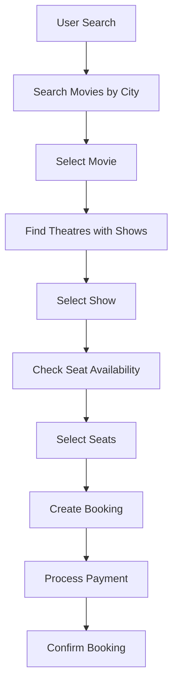

# BookMyShow - Low Level Design

A comprehensive movie booking system implementation in Python that demonstrates object-oriented design principles and provides a complete workflow for movie ticket booking operations.

## 🎬 Overview

The BookMyShow system is a Low-Level Design (LLD) implementation that showcases a typical movie booking platform workflow. It includes movie management, theatre operations, seat booking, show scheduling, and booking confirmation processes.

## 🏗️ System Architecture

The system follows object-oriented design principles with clear separation of concerns:

```
bookmyshow/
├── main.py                           # Entry point and demonstration
├── movie.py                          # Movie entity
├── theatre.py                        # Theatre entity
├── screen.py                         # Screen entity
├── seat.py                           # Seat entity
├── show.py                           # Show entity
├── booking.py                        # Booking entity
├── payment.py                        # Payment entity
├── movie_controller.py               # Movie management controller
├── theatre_controller.py             # Theatre management controller
└── enums/                            # Enumerations
    ├── city.py                       # City enumeration
    └── seat_category.py              # Seat category enumeration
```

## 🎯 Core Features

### 1. **Movie Management**
- Movie entity with ID, name, and duration
- City-based movie availability
- Centralized movie controller for operations
- Movie search and retrieval capabilities

### 2. **Theatre Operations**
- Theatre entity with location and screens
- Multiple screens per theatre
- City-based theatre management
- Theatre-show mapping

### 3. **Screen & Seat Management**
- Screen entity with seat configuration
- Seat categorization (Silver, Gold, Platinum)
- Seat availability tracking
- Dynamic seat allocation

### 4. **Show Scheduling**
- Show entity with movie, screen, and timing
- 24-hour format show timing
- Booked seat tracking
- Show-movie-theatre relationships

### 5. **Booking System**
- Booking entity with show and seat selection
- Payment integration
- Booking confirmation workflow
- Seat availability validation

## 🔧 Classes and Components

### Core Entities

| Class | Description |
|-------|-------------|
| `Movie` | Movie entity with ID, name, and duration |
| `Theatre` | Theatre entity with location, screens, and shows |
| `Screen` | Screen entity with seat configuration |
| `Seat` | Seat entity with category and location |
| `Show` | Show entity with movie, screen, timing, and booked seats |
| `Booking` | Booking entity with show, seats, and payment |
| `Payment` | Payment entity for transaction handling |

### Controllers

| Class | Description |
|-------|-------------|
| `MovieController` | Centralized movie management with city-based operations |
| `TheatreController` | Centralized theatre management with show retrieval |

### Enumerations

| Enum | Values | Purpose |
|------|--------|---------|
| `City` | Bangalore, Delhi | Supported cities |
| `SeatCategory` | SILVER, GOLD, PLATINUM | Seat pricing categories |

## 🚀 Getting Started

### Prerequisites
- Python 3.7 or higher
- No external dependencies required

### Installation
1. Clone or download the project
2. Navigate to the project directory
3. Run the main demonstration:

```bash
cd bookmyshow
python main.py
```

### Usage Example

```python
from main import BookMyShow
from enums.city import City

# Create and initialize the booking system
book_my_show = BookMyShow()
book_my_show.initialize()

# Create a booking for a movie in Bangalore
book_my_show.create_booking(City.Bangalore, "BAAHUBALI")

# Create another booking for the same movie
book_my_show.create_booking(City.Bangalore, "BAAHUBALI")
```

## 🎨 Design Patterns Used

1. **Controller Pattern**: Separate controllers for movie and theatre management
2. **Entity Pattern**: Clear separation of data entities and business logic
3. **Enumeration Pattern**: Type-safe constants for cities and seat categories
4. **Composition Pattern**: Complex objects composed of simpler entities

## 📊 System Workflow



## 🏛️ Class Diagram

```
┌─────────────────┐    ┌─────────────────┐    ┌─────────────────┐
│   BookMyShow    │────│ MovieController │    │TheatreController│
└─────────────────┘    └─────────────────┘    └─────────────────┘
         │                       │                       │
         │                       │                       │
         ▼                       ▼                       ▼
┌─────────────────┐    ┌─────────────────┐    ┌─────────────────┐
│     Movie       │    │    Theatre      │    │     Show        │
└─────────────────┘    └─────────────────┘    └─────────────────┘
                                │                       │
                                ▼                       ▼
                       ┌─────────────────┐    ┌─────────────────┐
                       │     Screen      │    │     Booking     │
                       └─────────────────┘    └─────────────────┘
                                │                       │
                                ▼                       ▼
                       ┌─────────────────┐    ┌─────────────────┐
                       │      Seat       │    │     Payment     │
                       └─────────────────┘    └─────────────────┘
```

## 🔮 Future Enhancements

### Potential Improvements
- Database integration for persistent storage
- REST API endpoints for web/mobile applications
- User authentication and authorization
- Advanced search and filtering capabilities
- Dynamic pricing based on seat category and demand
- Integration with external payment gateways
- Real-time seat availability checking
- Multi-language support
- Advanced reporting and analytics

### Extensibility Points
- **New Cities**: Easily add more cities to the system
- **New Seat Categories**: Add premium categories like VIP or recliner seats
- **Pricing Strategies**: Implement dynamic pricing algorithms
- **Payment Methods**: Add support for various payment options
- **User Management**: Add user profiles and booking history
- **Notification System**: Add email/SMS notifications for bookings

## 📝 Code Quality

- **Comprehensive Docstrings**: All classes and methods documented
- **Type Hints**: Full type annotation support
- **Clean Architecture**: Clear separation of concerns
- **SOLID Principles**: Following object-oriented design principles
- **Extensible Design**: Easy to add new features and components

## 🎭 Sample Data

The system comes pre-loaded with sample data:

### Movies
- **Avengers**: 128 minutes duration
- **Baahubali**: 180 minutes duration

### Theatres
- **INOX**: Located in Bangalore
- **PVR**: Located in Delhi

### Seats
- **100 seats per screen**:
  - Seats 1-40: SILVER category
  - Seats 41-70: GOLD category
  - Seats 71-100: PLATINUM category

### Shows
- Multiple shows per day with different timings
- Shows distributed across different theatres and cities

## 📄 License

This project is created for educational purposes to demonstrate Low-Level Design concepts in Python.

## 👥 Contributing

This is an educational project. Feel free to fork and extend it for learning purposes.

---