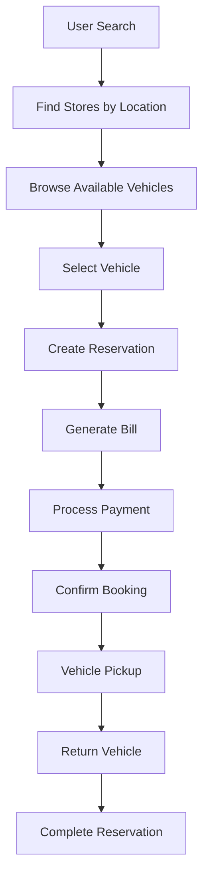

# Car Rental System

A comprehensive vehicle rental management system implemented in Python. This system demonstrates object-oriented design principles and provides a complete workflow for vehicle rental operations.

## 🚗 Overview

The Car Rental System is a Low-Level Design (LLD) implementation that showcases a typical vehicle rental business workflow. It includes user management, vehicle inventory, reservations, billing, and payment processing.

## 🏗️ System Architecture

The system follows object-oriented design principles with clear separation of concerns:

```
car_rental_system/
├── main.py                           # Entry point and demonstration
├── vehicle_rental_system.py          # Main system controller
├── store.py                          # Store management
├── user.py                           # User management
├── reservation.py                    # Reservation handling
├── bill.py                           # Billing calculations
├── payment.py                        # Payment processing
├── location.py                       # Location management
├── vehicle_inventory_management.py   # Inventory management
└── product/                          # Vehicle hierarchy
    ├── vehicle.py                    # Abstract base vehicle class
    ├── car.py                        # Car implementation
    └── bike.py                       # Bike implementation
```

## 🎯 Core Features

### 1. **Vehicle Management**
- Abstract vehicle hierarchy supporting cars and bikes
- Comprehensive vehicle attributes (ID, type, model, pricing, etc.)
- Status tracking (active/inactive)
- Inventory management per store

### 2. **User Management**
- User registration and profile management
- Driving license tracking
- User identification system

### 3. **Store Operations**
- Multiple store locations
- Location-based store discovery
- Store-specific vehicle inventory
- Reservation management per store

### 4. **Reservation System**
- Multiple reservation types (daily/hourly)
- Reservation status tracking (scheduled/completed/cancelled)
- Unique reservation ID generation
- Date and location management

### 5. **Billing & Payment**
- Automatic bill generation from reservations
- Flexible pricing calculation
- Payment processing workflow
- Payment status tracking

## 🔧 Classes and Components

### Core Classes

| Class | Description |
|-------|-------------|
| `VehicleRentalSystem` | Main system controller managing stores and users |
| `Store` | Individual rental location with inventory and reservations |
| `User` | Customer representation with personal details |
| `Reservation` | Booking details and status management |
| `Bill` | Billing calculations and cost tracking |
| `Payment` | Payment processing and transaction handling |
| `Location` | Geographical location representation |

### Vehicle Hierarchy

| Class | Description |
|-------|-------------|
| `Vehicle` | Abstract base class defining common vehicle interface |
| `Car` | Four-wheeled passenger vehicle implementation |
| `Bike` | Two-wheeled motor vehicle implementation |

### Enumerations

| Enum | Values | Purpose |
|------|--------|---------|
| `VehicleType` | CAR, BIKE | Vehicle categorization |
| `Status` | ACTIVE, INACTIVE | Vehicle availability |
| `ReservationType` | DAILY, HOURLY | Rental duration type |
| `ReservationStatus` | SCHEDULED, COMPLETED, CANCELLED | Booking status |

## 🚀 Getting Started

### Prerequisites
- Python 3.7 or higher
- No external dependencies required

### Installation
1. Clone or download the project
2. Navigate to the project directory
3. Run the main demonstration:

```bash
cd car_rental_system
python main.py
```

### Usage Example

```python
from vehicle_rental_system import VehicleRentalSystem
from user import User
from product.car import Car
from store import Store
from location import Location

# Create system components
user = User()
user.set_user_id(1)

car = Car()
car.set_vehicle_id(1)

store = Store()
store.set_store_id(1)
store.set_vehicles([car])

# Initialize system
rental_system = VehicleRentalSystem([store], [user])

# Find store and make reservation
location = Location(403012, "Bangalore", "Karnataka", "India")
store = rental_system.get_store(location)
vehicles = store.get_vehicles(VehicleType.CAR)
reservation = store.create_reservation(vehicles[0], user)

# Process billing and payment
bill = Bill(reservation)
payment = Payment(bill)
payment.pay_bill()
```

## 🎨 Design Patterns Used

1. **Abstract Factory Pattern**: Vehicle hierarchy with abstract base class
2. **Strategy Pattern**: Different reservation types and pricing strategies
3. **Template Method Pattern**: Common vehicle interface with specific implementations
4. **Composition Pattern**: System composed of stores, users, and vehicles

## 🔮 Future Enhancements

### Potential Improvements
- Database integration for persistent storage
- REST API endpoints for web/mobile applications
- Advanced search and filtering capabilities
- Dynamic pricing based on demand and availability
- Integration with external payment gateways
- Real-time availability checking
- Multi-language support
- Advanced reporting and analytics

### Extensibility Points
- **New Vehicle Types**: Easily add trucks, vans, or electric vehicles
- **Pricing Strategies**: Implement dynamic pricing algorithms
- **Payment Methods**: Add support for various payment options
- **Location Services**: Integrate with mapping and GPS services
- **Notification System**: Add email/SMS notifications

## 📊 System Workflow



## 📝 Code Quality

- **Comprehensive Docstrings**: All classes and methods documented
- **Type Hints**: Full type annotation support
- **Clean Architecture**: Clear separation of concerns
- **SOLID Principles**: Following object-oriented design principles
- **Extensible Design**: Easy to add new features and components

## 📄 License

This project is created for educational purposes to demonstrate Low-Level Design concepts in Python.

## 👥 Contributing

This is an educational project. Feel free to fork and extend it for learning purposes.

---
