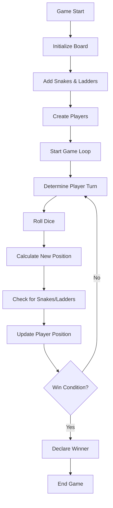

# Snake and Ladder - Low Level Design

A console-based implementation of the classic Snake and Ladder game built with Python, following object-oriented design principles. This system demonstrates a complete board game implementation with player management, dice rolling, and dynamic board generation.

## 🎲 Overview

The Snake and Ladder system is a Low-Level Design (LLD) implementation that showcases a typical board game workflow. It includes board generation, player management, dice rolling mechanics, snake/ladder effects, and win condition checking.

## 🏗️ System Architecture

The system follows object-oriented design principles with clear separation of concerns:

```
snake_and_ladder/
├── main.py                  # Entry point and demonstration
├── game.py                  # Main game controller
├── board.py                 # Board management and generation
├── dice.py                  # Dice rolling mechanics
├── player.py                # Player management
├── cell.py                  # Individual cell representation
└── jump.py                  # Snake and ladder implementation
```

## 🎯 Core Features

### 1. **Game Management**
- Main game controller orchestrating all components
- Turn-based gameplay with round-robin scheduling
- Win condition checking and game termination
- Real-time game state tracking

### 2. **Board Generation**
- Dynamic board creation with configurable size
- Random placement of snakes and ladders
- 2D grid representation with cell management
- Position-based cell access and manipulation

### 3. **Player Management**
- Multiple player support with unique identifiers
- Current position tracking for each player
- Turn management and player rotation
- Player state persistence throughout the game

### 4. **Dice Mechanics**
- Configurable number of dice (supports multiple dice)
- Random number generation with realistic dice values (1-6)
- Total sum calculation for movement
- Extensible dice system for different game variants

### 5. **Snake and Ladder Effects**
- Dynamic snake placement (moves players down)
- Dynamic ladder placement (moves players up)
- Automatic position adjustment when landing on jumps
- Visual feedback for snake/ladder encounters

## 🔧 Classes and Components

### Core Classes

| Class | Description |
|-------|-------------|
| `Game` | Main game controller managing gameplay flow |
| `Board` | Board representation with cells and jumps |
| `Dice` | Dice rolling functionality |
| `Player` | Player representation with position tracking |
| `Cell` | Individual board cell with optional jumps |
| `Jump` | Snake or ladder implementation |

### Game Components

| Component | Purpose |
|-----------|---------|
| **Board** | 2D grid of cells, some containing snakes/ladders |
| **Dice** | Generates random movement values (1-6 per die) |
| **Players** | Game participants with position tracking |
| **Jumps** | Snakes (move down) and ladders (move up) |

## 🚀 Getting Started

### Prerequisites
- Python 3.7 or higher
- No external dependencies required

### Installation
1. Clone or download the project
2. Navigate to the project directory
3. Run the main demonstration:

```bash
cd snake_and_ladder
python main.py
```

### Usage Example

```python
from game import Game

# Create and start a new game
game = Game()
game.startGame()

# The game will automatically:
# 1. Initialize a 10x10 board with 5 snakes and 4 ladders
# 2. Create 2 players (p1 and p2)
# 3. Run the game loop until someone wins
# 4. Display the winner
```

## 🎨 Design Patterns Used

1. **Controller Pattern**: Game class orchestrates all components
2. **Entity Pattern**: Clear separation of game entities (Board, Player, Dice)
3. **Composition Pattern**: Board composed of cells, cells may contain jumps
4. **Strategy Pattern**: Different types of jumps (snakes vs ladders)

## 📊 System Workflow



## 🏛️ Class Diagram

```
┌─────────────────┐    ┌─────────────────┐    ┌─────────────────┐
│      Game       │────│      Board      │    │      Dice       │
└─────────────────┘    └─────────────────┘    └─────────────────┘
         │                       │                       │
         │                       │                       │
         ▼                       ▼                       ▼
┌─────────────────┐    ┌─────────────────┐    ┌─────────────────┐
│     Player      │    │      Cell       │    │      Jump       │
└─────────────────┘    └─────────────────┘    └─────────────────┘
         │                       │
         │                       │
         └───────────────────────┘
```

## 🎮 Game Rules

### Basic Rules
1. **Starting Position**: All players start at position 0
2. **Movement**: Players roll dice and move forward by the dice value
3. **Snakes**: When landing on a snake head, player moves down to snake tail
4. **Ladders**: When landing on a ladder bottom, player moves up to ladder top
5. **Winning**: First player to reach or exceed the final position wins

### Game Configuration
- **Board Size**: 10x10 grid (100 positions)
- **Snakes**: 5 randomly placed snakes
- **Ladders**: 4 randomly placed ladders
- **Dice**: 1 die with values 1-6
- **Players**: 2 players (p1 and p2)

## 🔮 Future Enhancements

### Potential Improvements
- Configurable board size and number of players
- GUI interface with visual board representation
- AI players with different difficulty levels
- Game statistics and history tracking
- Network multiplayer support
- Custom snake and ladder placement
- Power-ups and special effects
- Tournament mode with multiple games

### Extensibility Points
- **New Board Sizes**: Easily modify board dimensions
- **Multiple Dice**: Support for different dice configurations
- **Special Cells**: Add cells with special effects (skip turn, extra roll, etc.)
- **Player Types**: Add AI players or different player behaviors
- **Game Modes**: Implement different rule variations
- **Scoring System**: Add points-based scoring instead of just winning

## 📝 Code Quality

- **Comprehensive Docstrings**: All classes and methods documented
- **Type Hints**: Full type annotation support
- **Clean Architecture**: Clear separation of concerns
- **SOLID Principles**: Following object-oriented design principles
- **Extensible Design**: Easy to add new features and components

## 🎲 Sample Gameplay

```
player turn is: p1 current position is: 0
player turn is:p1 new Position is: 3
player turn is: p2 current position is: 0
player turn is:p2 new Position is: 5
player turn is: p1 current position is: 3
player turn is:p1 new Position is: 8
jump done by: ladder
player turn is: p2 current position is: 5
player turn is:p2 new Position is: 9
...
WINNER IS: p1
```

## 📄 License

This project is created for educational purposes to demonstrate Low-Level Design concepts in Python.

## 👥 Contributing

This is an educational project. Feel free to fork and extend it for learning purposes.

---

## 🎯 Key Design Decisions

### 1. **Board Representation**
- 2D grid for easy visualization and access
- 1D position mapping for player movement
- Random snake/ladder placement for replayability

### 2. **Player Turn Management**
- Round-robin scheduling using list rotation
- Simple and fair turn distribution
- Easy to extend for more players

### 3. **Jump System**
- Unified Jump class for both snakes and ladders
- Direction determined by start/end position relationship
- Automatic position adjustment on landing

### 4. **Game State Management**
- Centralized game controller
- Clear separation of game logic and entities
- Easy to add new game features

## 🔧 Technical Implementation

### Random Generation
- Uses Python's `random` module for dice rolling
- Random snake and ladder placement for variety
- Seed-based generation for reproducible games (if needed)

### Position Calculation
- 1D to 2D coordinate conversion for board access
- Boundary checking for win conditions
- Automatic position adjustment for jumps

### Game Loop
- Simple while loop until win condition
- Clear turn progression and state updates
- Comprehensive logging for debugging
