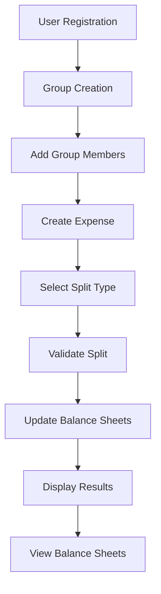

# Splitwise - Expense Splitting System

A comprehensive expense splitting and balance management system implemented in Python. This system demonstrates object-oriented design principles and provides a complete workflow for managing shared expenses among groups of users.

## 💰 Overview

The Splitwise system is a Low-Level Design (LLD) implementation that showcases a typical expense splitting application workflow. It includes user management, group management, expense creation, balance sheet calculations, and multiple split strategies.

## 🏗️ System Architecture

The system follows object-oriented design principles with clear separation of concerns:

```
splitwise/
├── main.py                           # Entry point and demonstration
├── splitwise.py                      # Main system controller
├── balance_sheet_controller.py       # Balance sheet management
├── balance.py                        # Individual balance tracking
├── user_expense_balance_sheet.py     # User balance sheet
├── user/                             # User management
│   ├── user.py                       # User entity
│   └── user_controller.py            # User operations
├── group/                            # Group management
│   ├── group.py                      # Group entity
│   └── group_controller.py           # Group operations
└── expense/                          # Expense management
    ├── expense.py                    # Expense entity
    ├── expense_controller.py         # Expense operations
    ├── split_factory.py              # Split strategy factory
    └── split/                        # Split strategies
        ├── split.py                  # Individual split
        ├── expense_split.py          # Abstract split base
        ├── equal_expense_split.py    # Equal split strategy
        ├── unequal_expense_split.py  # Unequal split strategy
        └── percentage_expense_split.py # Percentage split strategy
```

## 🎯 Core Features

### 1. **User Management**
- User registration and profile management
- Unique user identification system
- Personal expense balance sheet tracking
- User relationship management

### 2. **Group Management**
- Group creation and member management
- Group-specific expense tracking
- Member addition and removal
- Group expense history

### 3. **Expense Management**
- Multiple expense split types (Equal, Unequal, Percentage)
- Expense validation and processing
- Automatic balance sheet updates
- Expense history tracking

### 4. **Balance Sheet System**
- Real-time balance calculations
- User-to-user balance tracking
- Total expense and payment summaries
- Detailed balance breakdowns

### 5. **Split Strategies**
- **Equal Split**: Equal division among all participants
- **Unequal Split**: Custom amounts for each participant
- **Percentage Split**: Percentage-based division (extensible)

## 🔧 Classes and Components

### Core Classes

| Class | Description |
|-------|-------------|
| `Splitwise` | Main system controller managing users, groups, and expenses |
| `BalanceSheetController` | Handles balance sheet calculations and updates |
| `UserExpenseBalanceSheet` | Individual user's complete financial summary |
| `Balance` | Balance between two specific users |

### User Management

| Class | Description |
|-------|-------------|
| `User` | User entity with personal balance sheet |
| `UserController` | User management operations |

### Group Management

| Class | Description |
|-------|-------------|
| `Group` | Group entity with members and expenses |
| `GroupController` | Group management operations |

### Expense Management

| Class | Description |
|-------|-------------|
| `Expense` | Expense entity with split details |
| `ExpenseController` | Expense creation and processing |
| `Split` | Individual user's portion of an expense |

### Split Strategy Hierarchy

| Class | Description |
|-------|-------------|
| `ExpenseSplit` | Abstract base class for split strategies |
| `EqualExpenseSplit` | Equal division validation |
| `UnequalExpenseSplit` | Unequal division validation |
| `PercentageExpenseSplit` | Percentage-based division validation |
| `SplitFactory` | Factory for creating split strategies |

### Enumerations

| Enum | Values | Purpose |
|------|--------|---------|
| `ExpenseSplitType` | EQUAL, UNEQUAL, PERCENTAGE | Expense division strategy |

## 🚀 Getting Started

### Prerequisites
- Python 3.7 or higher
- No external dependencies required

### Installation
1. Clone or download the project
2. Navigate to the project directory
3. Run the main demonstration:

```bash
cd splitwise
python main.py
```

### Usage Example

```python
from splitwise import Splitwise
from user.user import User
from group.group import Group
from expense.expense_split_type import ExpenseSplitType
from expense.split.split import Split

# Initialize the system
splitwise = Splitwise()

# Create users
user1 = User("U1001", "User1")
user2 = User("U2001", "User2")
user3 = User("U3001", "User3")

# Add users to system
splitwise.user_controller.add_user(user1)
splitwise.user_controller.add_user(user2)
splitwise.user_controller.add_user(user3)

# Create a group
group = splitwise.group_controller.create_new_group("G1001", "Trip", user1)

# Add members to group
group.add_member(user2)
group.add_member(user3)

# Create expense splits
splits = [
    Split(user1, 300),
    Split(user2, 300),
    Split(user3, 300)
]

# Create expense with equal split
expense = group.create_expense("EXP001", "Dinner", 900, splits, 
                              ExpenseSplitType.EQUAL, user1)

# View balance sheets
for user in splitwise.user_controller.get_all_users():
    splitwise.balance_sheet_controller.show_balance_sheet_of_user(user)
```

## 🎨 Design Patterns Used

1. **Factory Pattern**: `SplitFactory` creates appropriate split strategies
2. **Strategy Pattern**: Different split strategies (Equal, Unequal, Percentage)
3. **Controller Pattern**: Separate controllers for different domains
4. **Composition Pattern**: System composed of users, groups, and expenses

## 📊 System Workflow



## 💡 Key Features Explained

### Balance Sheet Calculation
The system automatically calculates and maintains balance sheets for all users:
- **Total Your Expense**: Total amount you've spent
- **Total You Get Back**: Total amount others owe you
- **Total You Owe**: Total amount you owe to others
- **Total Payment Made**: Total amount you've paid
- **User-wise Breakdown**: Detailed balance with each user

### Split Strategies
1. **Equal Split**: Total amount divided equally among all participants
2. **Unequal Split**: Custom amounts for each participant (must sum to total)
3. **Percentage Split**: Percentage-based division (extensible for future use)

### Expense Processing
When an expense is created:
1. Split validation occurs based on split type
2. Balance sheets are updated for all involved users
3. User-to-user balances are calculated and stored
4. Total summaries are updated

## 🔮 Future Enhancements

### Potential Improvements
- Database integration for persistent storage
- REST API endpoints for web/mobile applications
- Real-time notifications for expense updates
- Currency support and exchange rates
- Expense categories and reporting
- Integration with payment gateways
- Multi-language support
- Advanced analytics and insights

### Extensibility Points
- **New Split Types**: Easily add new split strategies
- **Payment Integration**: Add support for direct payments
- **Notification System**: Add email/SMS notifications
- **Reporting**: Advanced expense reports and analytics
- **Multi-currency**: Support for different currencies

## 📝 Code Quality

- **Comprehensive Documentation**: All classes and methods documented with detailed docstrings
- **Type Hints**: Full type annotation support throughout the codebase
- **Clean Architecture**: Clear separation of concerns and responsibilities
- **SOLID Principles**: Following object-oriented design principles
- **Extensible Design**: Easy to add new features and components
- **Snake Case Naming**: Consistent Python naming conventions

## 🧪 Testing

The system includes a comprehensive demo that showcases:
- User creation and management
- Group creation and member addition
- Multiple expense types (Equal and Unequal splits)
- Balance sheet calculations and display
- Complete workflow demonstration

## 📄 License

This project is created for educational purposes to demonstrate Low-Level Design concepts in Python.

## 👥 Contributing

This is an educational project. Feel free to fork and extend it for learning purposes.

---